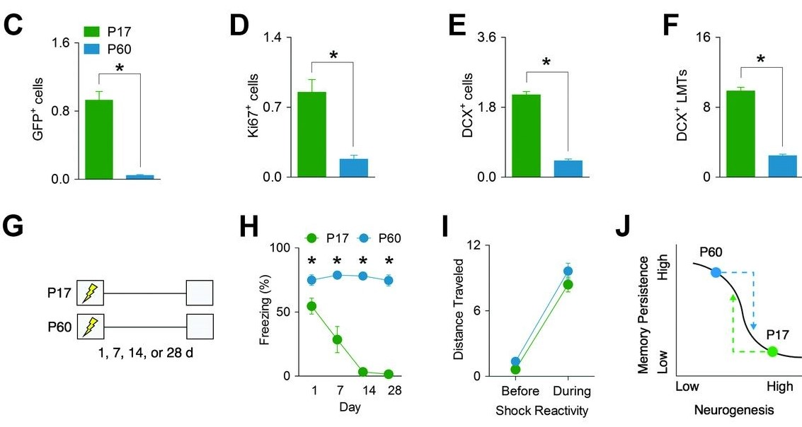

```{r setup, include=FALSE}
knitr::opts_chunk$set(echo = TRUE)
```

## Introduction

The subgranular zone (SGZ), located below the granule layer of the dentate gyrus (DG) region of the hippocampus, is one site of the brain that continues to birth new neurons throughout life, a process termed adult neurogenesis. Though neurogenesis begins high, newborn cells birth rates rapidly decline into adulthood. Facilitating adult neurogenesis promotes formation of new memories in the hippocampus. However, computational models predict that new cells added to the DG would also facilitate forgetting of established memories. The latter had not been shown in vivo models, and this study was intended to explore this possibility. The authors found that, as hypothesized, increased neurogenesis after a learning task was sufficient to induce forgetting.

In this report I reproduced the statistical analyses and visualization of figure 1 (fig1C, fig1D, fig1E, fig1F, fig1H, and fig 1I) as well as the supplementary figures S1 and S3b. Fig1 compared neurogenesis in infant (post-natal day 17; PD17) and adult (PD60) mice using viral label and immunohistochemistry  methodologies. Fig1C compared progenitor cell proliferation rates using a retrovirus to label progenitor cells and their progeny with green fluorescence protein (GFP). Fig1D compared the number of dividing cells using the endogenous proliferation marker KI-67. Fig1E compared the number of immature neurons using the immature neuron marker doublecortin (DCX). Fig1F compared the number of large mossy fiber terminals (LMTs) again using DCX. All groups were compared in fig1C-F using the two sample t-test. Mice were exposed to contextual fear learning and retested for freezing behavior 1, 7, 14, and 28 days later. Fig1H compared the percentage of time freezing (% freezing) after delay using a 2-way ANOVA, followed by post hoc t-test comparing age by day. Fig1I then confirmed that % freezing was not due to differences in reactivity to the shock stimulus by comparing distance traveled before and during the shock using a two-way ANOVA. FigS1 extended findings of Fig1d by comparing KI-67+ cells in mice PD16, PD28, PD60, PD120, and PD180 using a one-way ANOVA. FigS3B shows increases in % freezing for PD16 and PD60 mice after each shock (3 shocks given after minutes 3, 4, and 5), but no statistical comparison was done.

```{r libraries, include = FALSE}
library(tidyverse)
library(mosaic)
library(ggsignif)
library(gridExtra)
library(afex)
library(emmeans)
```

## Data analysis replication
### Fig1C
Importing file for Fig1c.
```{r Fig1C import}
###### Importing Fig1C

Fig1C <- read.csv("forgetting-data/Fig1C.csv")
head(Fig1C)
```
Analysis of Fig1C using two sample t-test. T value is different from that reported in text (t6 = 8.57, P <
0.001).

```{r Fig1C t-test}
# t-test between 17 and 60 GFP+ cells !!!t value different
t_test(GFP..cells ~ Age, data = Fig1C, var.equal = TRUE)
```
Preparing data to be plotted by calculating mean and standard error.

```{r Fig1C manipulation}
# Tibble with mean and standard error Fig1C
Fig1C_mean <- favstats(GFP..cells ~ Age, data = Fig1C) %>% 
  mutate(se = sd/sqrt(n))
head(Fig1C_mean)
```
Creating plot for Fig1C.

```{r Fig1C plot}
# Plot for above data
p1 <- ggplot(data = Fig1C_mean, aes(x = Age, y = mean, fill = Age)) +
  theme_classic() + #no grid and dark axis lines
  theme(axis.text.x = element_blank(), #hides text and ticks
        axis.ticks.x = element_blank(),
        legend.title = element_blank(),
        legend.position = c(0.35, 1)) +
  geom_errorbar(aes(ymin = mean - se, ymax = mean + se), width = 0.15, size = 1, color=c("#1aa700", "#2294d0")) + #error bar before mean bar hides lower
  geom_bar(stat= "identity") +
  labs(x = "", y= "GFP+ Cells", tag = "C") + #no x label 
  coord_cartesian(ylim = c(0, 1.6)) +
  scale_y_continuous(breaks = c(0, 0.8, 1.6), expand = c(0,0)) + #breaks to match fig, expand puts bars directly on axis
  geom_signif(comparisons = list(c("17", "60")), #ggsignif to add significance line
              annotation = "*") +
  scale_fill_manual("Age", values = c("17" = "#1aa700", "60" = "#2294d0"), labels = c("P17", "P60")) #bar colors
```

### FigS1
Importing file for Fig1DEF and FigS1.

```{r FigDEF and FigS1 import}
###### Importing Fig1DEF

Fig1DEF <- read.csv("forgetting-data/Fig1DEF_ and_FigS1.csv", stringsAsFactors = FALSE)
head(Fig1DEF)
```
Factoring age and adding id column to perform ANOVA.

```{r FigS1 ANOVA manipulation}
# Manipulating data for ANOVA
Fig1DEF <- Fig1DEF %>% 
  mutate(Age_f = factor(Age, levels = c("17", "28", "60", "120", "180"))) %>% 
  mutate(id = rownames(Fig1DEF))
head(Fig1DEF)
```
Performing the ANOVA for FigS1.

```{r FigS1 ANOVA}
# ANOVA
one_fit <- aov_ez("id", "Ki67..cells", data = Fig1DEF, between = c("Age_f"))
one_fit
```
Preparing data to be plotted by calculating mean and standard error.

```{r FigS1 plot manipulation}
# Tibble for visualizing FigS1
FigS1_mean <- favstats(Ki67..cells ~ Age_f, data = Fig1DEF) %>% 
  mutate(Age_f = factor(Age_f, levels = c("17", "28", "60", "120", "180"))) %>% 
  mutate(se = sd/sqrt(n))
head(FigS1_mean)
```
Creating plot for FigS1.

```{r FigS1 plot}
# Plotting FigS1
sp1 <- ggplot(data = FigS1_mean, aes(x = Age_f, y = mean, group = 1)) + 
  geom_line(color = "#1aa700", size = 1) +
  geom_point(color = "#1aa700", size = 4) +
  geom_errorbar(aes(ymin = mean - se, ymax = mean + se), width = .1, size = 1, color=c("#1aa700")) + 
  labs(x = "Age (days)", y = "Ki67+ cells") +
  theme_classic() +
  scale_y_continuous(breaks = c(0, 0.5, 1))
```

### Fig1D
Filtering Fig1DEF to only have P17 and P60.

```{r Fig1D manipulation t-test}
# Filtering for only ages 17 and 60
Fig1DEF_working <- Fig1DEF %>% 
  filter(Age_f %in% c("17", "60"))
head(Fig1DEF_working)
```
Analysis of Fig1D using two sample t-test.

```{r Fig1D t-test}
# t-test for Fig1D
t_test(Ki67..cells ~ Age, data = Fig1DEF_working, var.equal = TRUE)
```
Preparing data to be plotted by calculating mean and standard error.

```{r Fig1D manipulation plot}
# Tibble with mean and standard error Fig1D
Fig1D_mean <- favstats(Ki67..cells ~ Age, data = Fig1DEF_working) %>% 
  mutate(se = sd/sqrt(n))
head(Fig1D_mean)
```
Creating plot for Fig1D.

```{r Fig1D plot}
# Plotting Fig1D
p2 <- ggplot(data = Fig1D_mean, aes(x = Age, y = mean, fill = Age)) +
  geom_errorbar(aes(ymin = mean - se, ymax = mean + se), width = 0.15, size = 1, color=c("#1aa700", "#2294d0")) + #error bar   before mean bar hides lower
  geom_bar(stat= "identity") +
  labs(x = "", y= "Ki67+ Cells", tag = "D") + #no x label 
  coord_cartesian(ylim = c(0, 1.4)) +
  scale_y_continuous(breaks = c(0, 0.7, 1.4), expand = c(0,0)) + #breaks to match fig, expand puts bars directly on axis
  theme_classic() + #no grid and dark axis lines
  theme(axis.text.x = element_blank(), #hides text and ticks
        axis.ticks.x = element_blank(),
        legend.position = "none") + #removes legend
  geom_signif(comparisons = list(c("17", "60")), #ggsignif to add significance line
              annotation = "*") +
  scale_fill_manual("Age", values = c("17" = "#1aa700", "60" = "#2294d0")) #bar colors
```
### Fig1E
Removing missing values to make analyses and plotting easier for Fig1E and F.

```{r Fig1E NA removal}
# Removing NA
Fig1DEF_working <- Fig1DEF_working[-5,] %>% 
  mutate(DCX..cells = as.numeric(DCX..cells),
         DCX..LMTs = as.numeric(DCX..LMTs))
head(Fig1DEF_working)
```
Analysis of Fig1E using two sample t-test.

```{r Fig1E t-test}
# t-test for DCX cells
t_test(DCX..cells ~ Age, data = Fig1DEF_working, var.equal = TRUE)
```
Preparing data to be plotted by calculating mean and standard error.
 
```{r Fig1E manipulation}
# Tibble with mean and standard error Fig1E
Fig1E_mean <- favstats(DCX..cells ~ Age, data = Fig1DEF_working) %>% 
  mutate(se = sd/sqrt(n))
head(Fig1E_mean)
```
Creating plot for Fig1E.

```{r Fig1E plot}
# Plotting Fig1E
p3 <- ggplot(data = Fig1E_mean, aes(x = Age, y = mean, fill = Age)) +
  geom_errorbar(aes(ymin = mean - se, ymax = mean + se), width = 0.15, size = 1, color=c("#1aa700", "#2294d0")) + #error bar   before mean bar hides lower
  geom_bar(stat= "identity") +
  labs(x = "", y= "DCX+ Cells", tag = "E") + #no x label 
  coord_cartesian(ylim = c(0, 3.6)) +
  scale_y_continuous(breaks = c(0, 1.8, 3.6), expand = c(0,0)) + #breaks to match fig, expand puts bars directly on axis
  theme_classic() + #no grid and dark axis lines
  theme(axis.text.x = element_blank(), #hides text and ticks
        axis.ticks.x = element_blank(),
        legend.position = "none") + #removes legend
  geom_signif(comparisons = list(c("17", "60")), #ggsignif to add significance line
              annotation = "*") +
  scale_fill_manual("Age", values = c("17" = "#1aa700", "60" = "#2294d0")) #bar colors
```
### Fig1F
Analysis of Fig1F using two sample t-test.

``` {r fig 1f t-test}
# t-test for LMTs 
t_test(DCX..LMTs ~ Age, data = Fig1DEF_working, var.equal = TRUE)
```
Preparing data to be plotted by calculating mean and standard error.

```{r Fig1F manipulation}
# Tibble with mean and standard error Fig1F
Fig1F_mean <- favstats(DCX..LMTs ~ Age, data = Fig1DEF_working) %>% 
  mutate(se = sd/sqrt(n))
head(Fig1F_mean)
```
Creating plot for Fig1F.

```{r fig1F plot}
# Plotting fig1F
p4 <- ggplot(data = Fig1F_mean, aes(x = Age, y = mean, fill = Age)) +
  geom_errorbar(aes(ymin = mean - se, ymax = mean + se), width = 0.15, size = 1, color=c("#1aa700", "#2294d0")) + #error bar   before mean bar hides lower
  geom_bar(stat= "identity") +
  labs(x = "", y= "DCX+ LMTs", tag = "F") + #no x label 
  coord_cartesian(ylim = c(0, 16)) +
  scale_y_continuous(breaks = c(0, 8, 16), expand = c(0,0)) + #breaks to match fig, expand puts bars directly on axis
  theme_classic() + #no grid and dark axis lines
  theme(axis.text.x = element_blank(), #hides text and ticks
        axis.ticks.x = element_blank(),
        legend.position = "none") + #removes legend
  geom_signif(comparisons = list(c("17", "60")), #ggsignif to add significance line
              annotation = "*") +
  scale_fill_manual("Age", values = c("17" = "#1aa700", "60" = "#2294d0")) #bar colors
```
### Fig1H
Importing file for Fig1H and FigS3B and adding id column.

``` {r fig1h and FigS3B import}
###### Importing Fig1H_and_FigS3B
Fig1H_and_FigS3b <- read.csv("forgetting-data/Fig1H_ and_FigS3b.csv", stringsAsFactors = FALSE) %>% 
  mutate(id = c(1:70))
head(Fig1H_and_FigS3b)
```
Analysis of Fig1H using a 2 way ANOVA.

```{r fig1H ANOVA}
# ANOVA

two_fit <- aov_ez("id", "Test.Freezing", data = Fig1H_and_FigS3b,
                  between = c("Age", "Day"))
two_fit
```
Post hoc t-testss for age by day.

```{r fig1H posthoc}
posthoc <- pairs(emmeans(two_fit, "Age", by = "Day"), adjust = "none")
posthoc
```
Preparing data to be plotted by caluating mean and standard error. Day was mutated to a factor so that the x-axis ticks were evenly spaced.

```{r fig1H manipulation}
# Manipulating data for visualization
Fig1H_mean <- Fig1H_and_FigS3b %>% 
  group_by(Age, Day) %>% 
  summarize(mean = mean(Test.Freezing),
            sd = sd(Test.Freezing),
            se = sd/sqrt(n())) %>% 
  mutate(Day_f = factor(Day, levels = c("1", "7", "14", "28")))
head(Fig1H_mean)
```
Creating plot for Fig1H.

```{r fig1H plot}
# Plotting Fig1H
p5 <- ggplot(data = Fig1H_mean, aes(x = Day_f, y = mean, group = factor(Age), color = factor(Age))) +
  geom_point(size = 4) +
  geom_line() +
  geom_errorbar(aes(ymin = mean - se, ymax = mean + se), width = 0.1) +
  labs(x = "Day", y= "Freezing (%)", tag = "H") +
  coord_cartesian(ylim = c(0, 100)) +
  scale_y_continuous(breaks = c(0, 50, 100), expand = c(0,0)) +
  scale_color_manual(values = c("#1aa700", "#2294d0"), labels = c("P17", "P60")) +
  theme_classic() + #no grid and dark axis lines
  theme(axis.ticks.x = element_blank(), legend.title = element_blank(), legend.position = "top") +
  geom_signif(y_position = c(84), xmin = c(1:4), xmax = c(1:4), annotation = "*", color = "black", tip_length = 0, size = 0)
p5
```
### FigS3b
No analyses were done for the data in FigS3B.

Preparing data to be visualized for FigS3B by pivoting each train.min column under the minute column and values in the freezing column.
``` {r figS3b manipulation}
# Manipulating for figure S3b
FigS3b <- pivot_longer(data = Fig1H_and_FigS3b, cols = c("Train.Min..1.Freezing", "Train.Min..1.Freezing.1", 
                                                         "Train.Min..1.Freezing.2", "Train.Min..1.Freezing.3",
                                                         "Train.Min..1.Freezing.4"), 
                       names_to = "minute", values_to = "freezing")
head(FigS3b)
```
Preparing data to be plotted by calulating mean and standard error.

```{r figS3B manipulation plot}
# Manipulation for visualization 
FigS3b_mean <- FigS3b %>% 
  group_by(Age, minute) %>% 
  summarize(mean = mean(freezing), 
             sd = sd(freezing),
             se = sd/sqrt(n()))
head(FigS3b_mean)
```
Creating plot for Fig3SB.

```{r figS3b plot}
# Plotting FS3b

sp2 <- ggplot(data = FigS3b_mean, aes(x = minute, y = mean, group = factor(Age), color = factor(Age))) +
  geom_point(size = 4) +
  geom_line(size = 1) +
  geom_errorbar(aes(ymin = mean - se, ymax = mean + se), width = 0.05, size = 1) +
  labs(x = "Minute", y= "Freezing (%)") +
  coord_cartesian(ylim = c(0, 100)) +
  scale_y_continuous(breaks = c(0, 50, 100), expand = c(0,0)) +
  theme_classic() + #no grid and dark axis lines
  scale_color_manual(values = c("#1aa700", "#2294d0"), labels = c("P17", "P60")) +
  theme(legend.title = element_blank(), legend.position = c(0.075, 0.95)) +
  scale_x_discrete(labels = c("1", "2", "3", "4", "5"))
```
### Fig1I
Importing file for Fig1I.

``` {r fig1I import}
###### Importing Fig1I
Fig1I <- read.csv("forgetting-data/Fig1I.csv", stringsAsFactors = FALSE)
head(Fig1I)
```
preparing data for ANOVA by pivotting shock columns to condition column and value to distance.traveled. Also factoring age and condition in addition to adding id column.

```{r fig1I manipulation ANOVA}
# Manipulating data to do ANOVA
Fig1I <- pivot_longer(data = Fig1I, cols= ends_with(".shock"),
                      names_to= "condition", values_to = "Distance.traveled") %>% 
  mutate(Age_f = factor(Age, levels = c("17", "60")),
         condition_f = factor(condition, levels = c("Before.shock", "During.shock")),
         id = c(1:34))
head(Fig1I)
```
Analysis of Fig1I using 2 way ANOVA.

```{r fig1I ANOVA}
# The test
two_fit2 <- aov_ez("id", "Distance.traveled", data = Fig1I,
                  between = c("Age_f", "condition_f"))
two_fit2
```
Preparing data to be plotted by calculating mean and standard error.

```{r fig1I manipulation plot}
# Manipulating data for visualization
Fig1I_mean <- Fig1I %>% 
  group_by(Age, condition) %>% 
  summarize(mean = mean(Distance.traveled),
            sd = sd(Distance.traveled),
            se = sd/sqrt(n()))
head(Fig1I_mean)
```
Creating plot for Fig1I

```{r fig1I plot}
# Plotting Fig1I
p6 <- ggplot(data = Fig1I_mean, aes(x = condition, y = mean, group = Age)) +
  geom_point(size = 4, color = c("#1aa700", "#1aa700","#2294d0", "#2294d0")) +
  geom_line(color = c("#1aa700", "#1aa700","#2294d0", "#2294d0")) +
  geom_errorbar(aes(ymin = mean - se, ymax = mean + se), width = 0.05, size = 1, 
                color = c("#1aa700", "#1aa700","#2294d0", "#2294d0")) +
  labs(x = "Shock Reactivity", y= "Distance Traveled", tag = "I") +
  coord_cartesian(ylim = c(0, 12)) +
  scale_y_continuous(breaks = c(0, 6, 12), expand = c(0,0)) +
  theme_classic() + #no grid and dark axis lines
  scale_x_discrete(labels = c("Before", "After"))
```
### Plotting
Recreating Figure 1. Cropped image from paper below.
```{r Fig1 visualization}
# Visualization 
lay <- rbind(c(1,2,3,4),
             c(NA,6,7,NA))
grid.arrange(p1, p2, p3, p4, p5, p6, layout_matrix = lay)

```

Recreating FigS1. Cropped image from paper below.

```{r FigS1 visualization}
sp1
knitr::include_graphics("images/FS1.jpg")
```

Recreating FigS3B. Cropped image from paper below.

```{r FigS3b visualization}
sp2
knitr::include_graphics("images/FS3B.jpg")
```

## Discussion and Reflection

Overall, the data replication for Figures 1, S1 and S3B were successful. Fig1C-F used a two sample t-test to compare PD17 and PD60 mice. Fig1C compared GFP+ cells, I found t6= 8.51, P<0.001 while the author’s reported t6=8.57, P<0.001. Considering the degrees of freedom matched and two sample t-test was done for all other data reported in fig1C-F, I believe this was a data entry mistake in their report. Every other data analyzed matched that reported in the original. 

Fig1D found Ki67+ cells higher in PD17 compared to PD60 (t7=4.53, P< 0.01). Fig1E found DCX+ cells higher in PD17 compared to PD60 (t6=18.65, P<0.001). Fig1F found DCX+ LMTs higher in PD17 compared to PD60 (t6=15.03, P<0.001). FigS1 extended Fig1D findings by comparing Ki67+ cells in PD17, PD28, PD60, PD120, and PD180 mice using a one way ANOVA. A main effect was found for age (F4,17= 23.62, P<0.001).

Fig1H compared % freezing, as a measure of forgetting, in contextual fear conditioning after different intervals for PD17 and PD60 mice using a two-way ANOVA. Post hoc t-tests comparing age by day followed (1 day, P < 0.05; 7 days, P < 0.001; 14 days, P < 0.001; 28 days, P < 0.001). A main effect was found for age x day (F3,62= 13.07, P< 0.001). Fig1I compared distance traveled in PD17 and PD60 mice before and during shock as a measure of reactivity to the shock stimulus. No difference was found in reactivity between the two age groups (F1,30= 0.25, P=0.62).

The format of the data used was already in an easily readable format (.csv) and was organized well. There was no missing data and original data analyses were communicated well in the original publication. Some file and column names were titled oddly (ex. Train.Min..1.Freezing.3), but using names() and copy/pasting directly alleviated this. 

Formatting the visualization of the data to match that of the original publication was the most demanding task, especially when using grid.arrange() since that applies additional formatting to a plot compared to how it would look rendered alone. This took some time making changes and reknitting the document to make it aesthetically pleasing. 
